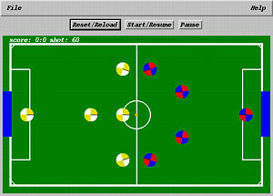
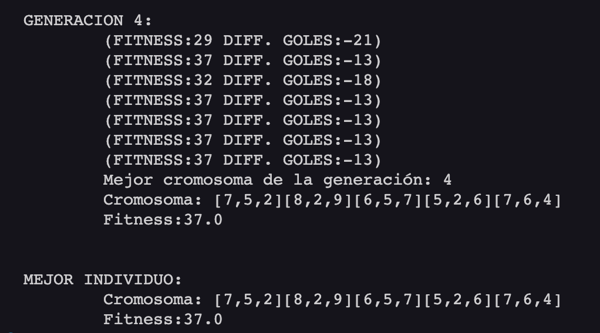

## Algoritmo Genetico TBSim - 

### Descripcion del problema

Este proyecto se centra en la aplicación de algoritmos genéticos en entornos de Computación de Alto Rendimiento (HPC), con un enfoque en el multiprocesamiento para simular organismos inteligentes. Utiliza el simulador TBSim parametrizando un equipo basico, adaptado para entornos HPC, para investigar la evolución y el comportamiento de agentes en un entorno simulado de fútbol robótico.

### Objetivos

#### Objetivo General: Evaluar el rendimiento y operación de un HPC en la optimización de un sistema multiagente, utilizando algoritmos genéticos para la liga RoboCup Sim.

#### Objetivos Específicos:

    - Establecer un ambiente de desarrollo y simulación mediante contenedores usando Docker.
    - Instrumentalizar el código de TBSim para parametrizar agentes de software.
    - Integrar algoritmos genéticos en TBSim para ejecución paralela.
    - Ejecutar simulaciones en HPC para optimizar parámetros del sistema multiagente.
    - Evaluar la eficiencia y eficacia del HPC.
    - Realizar análisis y documentación de resultados.

### Requerimientos

- Python 3.11 o superior
- Java versión "21.0.1" 2023-10-17 LTS
- JGAP library (incluida en el directorio lib/)

### Estrucutra del proyecto

- src/: Directorio que contiene el código fuente.
- bin/: Directorio para los archivos compilados (.class).
- lib/: Contiene las bibliotecas externas, incluyendo jgap-3.4.4.jar.
- doc/: Directorio para la documentación generada.
- Makefile: Utilizado para automatizar la compilación, ejecución y otras tareas.

### Compilación y ejecución

Utiliza el Makefile incluido para las siguientes tareas, en la raíz del proyecto:

- `make`: Compila el código fuente.
- `make run`: Ejecuta el programa.
- `make clean`: Elimina los archivos compilados.
- `make doc`: Genera la documentación.
- `make zip`: Empaqueta los archivos para su entrega.

### Documentación

#### Estrategias de Comportamiento de Robots en TBSim

##### Configuración de Parámetros del Robot

El sistema utiliza tres parámetros clave para definir el comportamiento estratégico de los robots en un entorno simulado de fútbol:

- `disPo`: Distancia umbral que determina cuándo un robot debe considerarse en posición para patear la pelota. Este parámetro influye en la decisión del robot sobre cuándo prepararse para un ataque o un tiro.
- `disKick`: Distancia a la que un robot intentará patear la pelota. Este valor es crucial para la ejecución de acciones ofensivas y defensivas.
- `disTeam`: Distancia a mantener entre compañeros de equipo para evitar colisiones y aglomeraciones. Este parámetro asegura una distribución eficiente de los robots en el campo.

##### Lógica de Movimiento del Robot

La estrategia de movimiento varía según el rol del robot en el equipo, que puede ser portero, defensa, mediocampista, delantero o mediocampista ofensivo. Se definen posiciones estratégicas en el campo para cada robot, como Northspot, Southspot, Backspot, Kickspot, Goaliepos, y Awayfromclosest. Estas posiciones guían a los robots en sus decisiones tácticas durante el juego.

* Northspot: Posición al norte de la posición defensiva.
* Southspot: Posición al sur de la posición defensiva.
* Backspot: Posición detrás de la pelota a una distancia mayor, utilizado para posiciones defensivas o de preparación.
* Kickspot: Punto de patada, que es un lugar estratégico detrás de la pelota desde donde el robot puede patear efectivamente hacia la portería contraria.
* Goaliepos: Posición ideal para el portero, entre la pelota y nuestra portería.
* Awayfromclosest: Dirección para alejarse del compañero de equipo más cercano, útil para evitar aglomeraciones y mejorar la cobertura del campo.
* Ball: Posición de la pelota.
* Closestteammate: Posición del compañero de equipo más cercano.

#### Funcion de Evaluación para Algoritmos Genéticos (Aptitud)

La clase FuncionEvaluacion se utiliza para evaluar la aptitud (fitness) de los individuos en una población de algoritmos genéticos. Utiliza un valor de MAXDIF para determinar la diferencia máxima de goles favorable. Esta clase es crucial para optimizar las estrategias del equipo de fútbol robot simulado.

#### Punto de Entrada Principal y Ejecución

El archivo Main.java sirve como punto de entrada principal para la ejecución del algoritmo genético. Aquí se configura el algoritmo genético, se define el cromosoma de muestra, y se ejecuta la evolución de la población. Además, se realiza la inicialización y escritura de los resultados en un archivo CSV.

#### Simulacion Sin Interfaz Grafica

`TBSimNoGraphics.java` es la clase que maneja la simulación del fútbol de robots sin interfaz gráfica. Utiliza semáforos para controlar el flujo de la simulación y para sincronizar el inicio. Esta clase permite ejecutar simulaciones en un entorno sin necesidad de interacción visual, lo que es ideal para ejecuciones en HPC.

### Autor

- Sebastian Allende